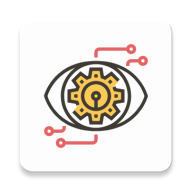
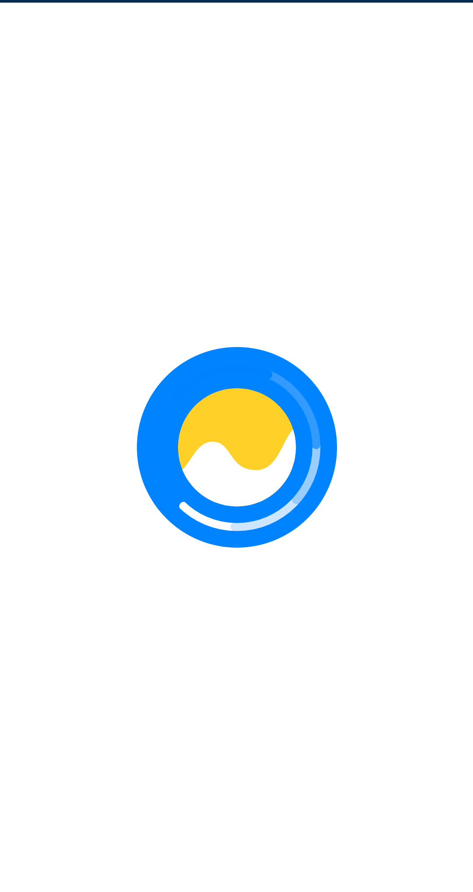
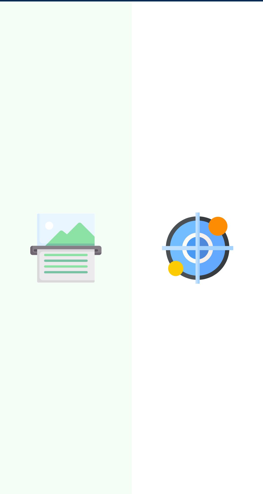
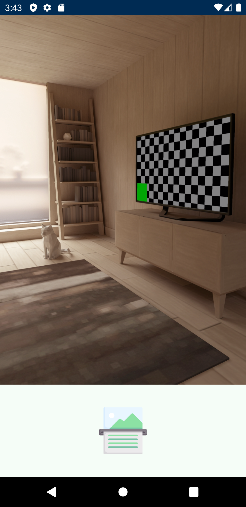
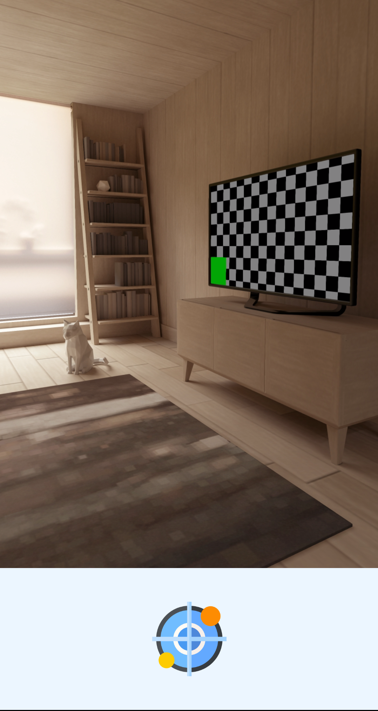

# RepEye
is an Android Application for people who are blind. The application simulates some of the basic function of human eye, object detection and reading. RebEye has a user-friendly exprience for both blind and others as the application uses computer generated voice to guide the user through the different screens.

## Screenshots

  
  
  
  

## License

This project is currently licensed under the MIT License. A copy of [LICENSE](LICENSE.md) is to be present along with the source code.
